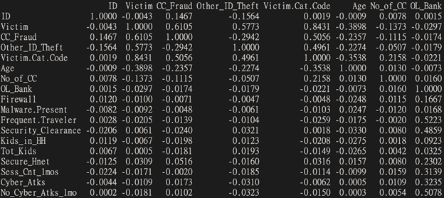

# DATS 6501 - Capstone Project - Sayra Moore

Welcome to my github site, where you will find my commented code for my [capstone project] (DATS 6501 - Capstone Project - Sayra Moore.docx)! The purpose of this project was to focus on determining if a person would fall victim to a cybercrime when taking into consideration

# Code

### Reading in data set
```markdown
cyber <- read.csv(file = "C:/Users/ipcon/OneDrive - The George Washington University/Summer 2021/DATS 6501/DATS 6501 - Capstone Project - Sayra Moore/Cybercrime_Dataset Clean_CSV.csv")
str(cyber)

summary(cyber)
```

## Correlation
``` 
cor.test(cyber$Age,cyber$No_Cyber_Atks_1mo,method = "pearson")
plot(cyber$Age,cyber$No_Cyber_Atks_1mo)
```
Figure 1


``` 
cor.test(cyber$Sess_Cnt_1mos,cyber$No_Cyber_Atks_1mo,method="pearson")
plot(cyber$Sess_Cnt_1mos,cyber$No_Cyber_Atks_1mo)
```
Figure 2


## Data Cleansing
### Cleaning the "CC_Fraud" variable:
```
cyber$CC_Fraud <- gsub("No",0,cyber$CC_Fraud)
cyber$CC_Fraud <- as.integer(cyber$CC_Fraud)
```

### Cleaning the "Date of Attack" variable:
```
cyber$Date.of.Attack <- as.Date(cyber$Date.of.Attack,format="%m/%d/%Y")
```

### Cleaning the "Computer" variable:
```
cyber$Computer <- gsub("No",0,cyber$Computer)
cyber$Computer <- gsub("Yes",1,cyber$Computer)
cyber$Computer <- as.integer(cyber$Computer)
```

### Cleaning the "Tablet" variable:
```
cyber$Tablet <- gsub("No",0,cyber$Tablet)
cyber$Tablet <- gsub("Yes",1,cyber$Tablet)
cyber$Tablet <- as.integer(cyber$Tablet)
```

### Cleaning the "Cell_Phone" variable:
```
cyber$Cell_Phone <- gsub("No",0,cyber$Cell_Phone)
cyber$Cell_Phone <- gsub("Yes",1,cyber$Cell_Phone)
cyber$Cell_Phone <- as.integer(cyber$Cell_Phone)
```

### Cleaning the "Social_Net" variable:
```
cyber$Social_Net <- gsub("No",0,cyber$Social_Net)
cyber$Social_Net <- gsub("Yes",1,cyber$Social_Net)
cyber$Social_Net <- as.integer(cyber$Social_Net)
```

### Cleaning the "Malware.Present variable:
```
cyber$Malware.Present <- gsub("No",0,cyber$Malware.Present)
cyber$Malware.Present <- gsub("Yes",1,cyber$Malware.Present)
cyber$Malware.Present <- as.integer(cyber$Malware.Present)
```
### Carrying forward the last observations for NAs
```
install.packages("xts", repos="http://cloud.r-project.org")
library(xts)
cyber <- na.locf(cyber)

str(cyber)
```

### Exporting a cleaned version to use for the visualizations in Tableau
```
write.csv(cyber,"C:/Users/ipcon/OneDrive - The George Washington University/Summer 2021/DATS 6501/Cyber_Cleaned.csv", row.names = FALSE)
```

### Creating a dataframe with integer variables only, in order to create correlation matrix
```
install.packages("tidyverse")
library(dplyr)
cyberint <- select_if(cyber,is.integer)
str(cyberint)
round(cor(cyberint),4)
```
Figure 3


## Modeling
### Model with all continuous independent variables
```
glmcyber_fit1 <- glm(Victim~Age+No_of_CC+Tot_Kids+Sess_Cnt_1mos, data=cyber)
summary(glmcyber_fit1)
plot(glmcyber_fit1)
```
Figure 4.1

Figure 4.2

Figure 4.3

Figure 4.4


### Model with independent variables with the assumed biggest impact
```
glmcyber_fit2 <- glm(Victim~Age+Computer+Cell_Phone+No_of_CC+Sess_Cnt_1mos, data=cyber)
summary(glmcyber_fit2)
plot(glmcyber_fit2)
```
Figure 5.1

Figure 5.2

Figure 5.3

Figure 5.4


```
with(cyber,plot(cyber$Sess_Cnt_1mos,cyber$No_Cyber_Atks_1mo,
                xlab="# of Sessions Per Month",
                ylab="# of Cyber Attacks Per Month",
                main="Sessions vs. Cyber Attacks"))
with(cyber,points(cyber$Sess_Cnt_1mos[cyber$Victim==1],cyber$No_Cyber_Atks_1mo[cyber$Victim==1],pch=16,col="red"))
with(cyber,points(cyber$Sess_Cnt_1mos[cyber$Victim==0],cyber$No_Cyber_Atks_1mo[cyber$Victim==0],pch=17,col="green"))
```
Figure 6


### Logistic Regression
```
glmcyber_fit1 <- glm(formula=Victim~CC_Fraud+Other_ID_Theft+Computer+Tablet+Cell_Phone+Social_Net+OL_Bank+Firewall+Malware.Present+Frequent.Traveler+Security_Clearance+Kids_in_HH+Secure_Hnet+Cyber_Atks,data=cyber,family=binomial,maxit=50)
summary(glmcyber_fit1)
```
Figure 7


### Clustering with K-Means
```
cyberkmeans<- cyber[,c("Victim", "CC_Fraud", "Other_ID_Theft")]

fit <- kmeans(cyberkmeans, 3)
aggregate(cyberkmeans,by=list(fit$cluster),FUN=mean)
cyberkmeans <- data.frame(cyberkmeans, fit$cluster)

install.packages("mclust")
library(mclust)
fit <- Mclust(cyberkmeans)
plot(fit)
summary(fit)
```
Figure 9

Figure 10

Figure 11

Figure 12


### K-Means Clustering with 3 clusters
```
fit <- kmeans(cyberkmeans, 3)
```

### Cluster Plot against 1st 2 principal components vary parameters for most readable graph
```
library(cluster) 
clusplot(cyberkmeans, fit$cluster, color=TRUE, shade=TRUE, labels=2, lines=0)
```
Figure 13


### Centroid Plot against 1st 2 discriminant functions
```
install.packages("fpc")
library(fpc)
plotcluster(cyberkmeans, fit$cluster)
```
Figure 14

